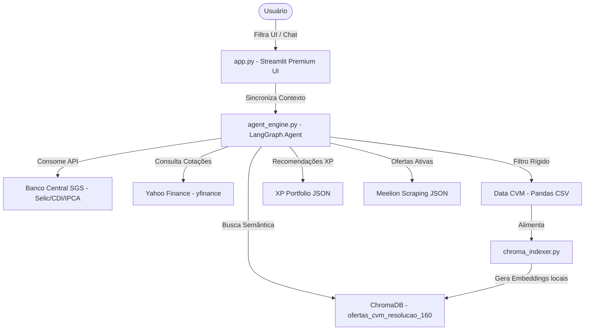

# ⚡ Antigravity-BTG — Plataforma Analítica & Agente Inteligente de Renda Fixa

Esta é a plataforma **Antigravity-BTG**, uma solução analítica integrada de alta performance concebida para a análise, comparação e contextualização de ofertas primárias e secundárias de Renda Fixa no Brasil.

O sistema integra dados oficiais governamentais da CVM, dados macroeconômicos em tempo real do Banco Central, cotações financeiras ao vivo do Yahoo Finance e ofertas ativas de mercado (XP Investimentos e Meelion), conectando tudo a um **Agente ReAct Inteligente via LangGraph** operado em um painel **Sleek Dark Mode** em Streamlit.

---

## 📐 Arquitetura da Plataforma

O fluxo de dados e controle entre os módulos segue uma topologia altamente integrada e otimizada:



---

## 📂 Estrutura de Módulos Implementados

### 1. `app.py` (Painel Streamlit Premium)
- **Tema & Visual**: Interface concebida em **Sleek Dark Mode** (HSL tailoreado, preto profundo e neons azuis/verdes) com cartões glassmórficos para exibir os principais KPIs macro (Selic, CDI, IPCA) direto do Banco Central.
- **Visualização Dinâmica**: Filtros laterais conectados a gráficos interativos Plotly (distribuição por ativos e volumes) e tabela formatada com suporte a downloads.
- **Sincronização de Chat**: O canal de chat de IA recebe silenciosamente os filtros aplicados pelo usuário no painel, garantindo que o agente possua contexto visual completo.

### 2. `agent_engine.py` (Motor de IA - LangGraph)
- **Raciocínio ReAct**: Grafo cíclico estruturado para processar perguntas, invocar dinamicamente as ferramentas e ponderar os resultados utilizando o modelo avançado **Llama-3.3-70b-versatile (Groq)**.
- **Princípios Financeiros**: Especializado em análises de spreads, isenções tributárias e regras de garantia do FGC.

### 3. `tools_custom.py` (Biblioteca de Ferramentas)
Módulo centralizado contendo 7 ferramentas altamente robustas expostas ao agente:
1. `resumo_mercado_cvm` — Estatísticas macro de distribuição da CVM.
2. `buscar_ofertas_cvm` — Filtros de busca estritos por emissor, líder e data.
3. `carteira_recomendada_xp` — Títulos recomendados pela XP Investimentos.
4. `investimentos_meelion` — Scraping ativo de CDBs e LCIs do comparador de mercado.
5. `consultar_indicadores_macro` — API do Banco Central (SGS) de Selic, CDI e IPCA (dotada de tratamento de timeout e fallback de dados).
6. `buscar_ofertas_similares_chromadb` — Busca semântica vetorial por teses de investimento.
7. `consultar_yfinance` — Cotações de mercado ao vivo para fundos e ativos listados na B3.

### 4. `chroma_indexer.py` (Indexador Vetorial)
- Carrega as 13.139 ofertas da CVM (Resolução 160) e gera embeddings locais (`all-MiniLM-L6-v2` via `onnxruntime` em CPU) de forma 100% segura e offline, armazenando no banco ChromaDB local.

---

## 🔒 Conformidade de Segurança e Rastreabilidade

- **Downloads Verificados**: Todas as dependências e coletas de dados provêm de fontes oficiais auditáveis (dados governamentais da CVM, Banco Central, PyPI, e CDN oficial Microsoft para o Playwright).
- **Proteção de Credenciais**: Chaves de API pessoais e dados confidenciais são isolados no arquivo `.env`, blindado por regras do `.gitignore` contra compartilhamento público no GitHub.

---

## ⚡ Como Executar a Plataforma

Para rodar a plataforma em sua máquina e acessar a interface interativa:

1. **Ativar o Ambiente Virtual**:
   ```powershell
   ExemploDeCódigoLangChain\venv\Scripts\Activate.ps1
   ```
2. **Executar a Interface Streamlit**:
   ```powershell
   streamlit run app.py
   ```
3. O painel será aberto automaticamente no seu navegador em `http://localhost:8501/`.
