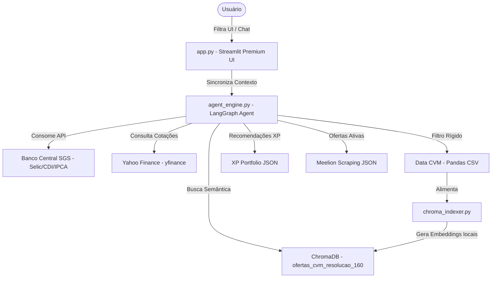

# 📝 Relatório de Desenvolvimento — Agente Inteligente de Ofertas Primárias (BTG Pactual)

Este documento registra o processo de desenvolvimento, decisões técnicas e metodológicas, fontes de dados, modelos e resultados obtidos na construção do Agente Inteligente de Análise e Contextualização de Ofertas Primárias.

---

## 1. Etapas de Desenvolvimento

Abaixo está o cronograma e o status das etapas planejadas para a entrega expressa do projeto:

- [x] **Etapa 1: Alinhamento de Conceitos e Arquitetura**
  - Entendimento do TAPI, mapeamento dos conceitos financeiros e das ferramentas de IA/Web.
  - Setup do cofre Obsidian Zettelkasten para persistência de conhecimento.
- [x] **Etapa 2: Configuração de Ambiente e Dependências**
  - Criação do ambiente virtual (`venv`) e instalação dos pacotes necessários (`streamlit`, `chromadb`, `python-bcb`, `yfinance`, `langchain-community`, `langchain-chroma`).
- [x] **Etapa 3: Ingestão e Estruturação de Dados**
  - Integração do script da CVM para processar ofertas públicas.
  - Setup do scraping/coleta de ofertas vigentes do mercado secundário/primário (XP Investimentos e Meelion) salvas em JSON.
  - Configuração do repositório Git e sincronização com o GitHub.
- [x] **Etapa 4: Construção da Base Vetorial (ChromaDB)**
  - Criação do script `chroma_indexer.py` para carregar as ofertas da CVM.
  - Teste de embeddings locais (`all-MiniLM-L6-v2` via onnxruntime) e correção de tratamento de exceções do ChromaDB.
  - Execução inicial da indexação em lotes de 500 concluída no background.
- [x] **Etapa 5: Implementação do Agente Inteligente (LangChain / LangGraph)**
  - Criação do agente ReAct para receber as perguntas do usuário, pesquisar dados via tools e responder.
  - Implementação das tools: busca de ofertas da CVM, dados macroeconômicos do BCB e comparativos no ChromaDB.
  - *Refinamento em andamento*: Ajuste das diretrizes do prompt do sistema para forçar especificidade (evitar respostas teóricas/didáticas gerais) e exibição em tabelas Markdown.
- [x] **Etapa 6: Desenvolvimento da Interface Visual (Streamlit)**
  - Construção do dashboard interativo com filtros.
  - Integração de gráficos Plotly da evolução de taxas e tabelas.
  - Caixa de chat integrada para o usuário conversar diretamente com o agente de IA.
  - *Refinamento em andamento*: Coleta de feedback de UX para reestruturação do layout.
- [/] **Etapa 7: Testes, Refinamento e Documentação Final**
  - Testes ponta a ponta e finalização do relatório de entrega com base no novo design de UX.

---

## 2. Arquitetura da Plataforma e Fluxo de Dados

A plataforma Nexus foi desenhada de forma modular e altamente integrada, visando performance, facilidade de auditoria técnica e governança. O fluxo de dados e controle entre os componentes da plataforma segue a arquitetura descrita abaixo:

---

## 3. Decisões Metodológicas Adotadas

### 2.1. Arquitetura do Agente: ReAct (Reasoning + Acting)
Optou-se pelo padrão **ReAct** utilizando a biblioteca **LangGraph**. Esse padrão permite que o modelo (LLM) decida dinamicamente qual ferramenta usar, analise o resultado retornado por ela, reformule seu raciocínio e decida o próximo passo. Isso é crucial para responder perguntas complexas do tipo: *"Como as taxas de CDB indexadas ao IPCA mudaram após a última decisão do Copom sobre a taxa Selic?"*

### 2.2. Armazenamento e Recuperação Semântica (ChromaDB)
Para comparar ofertas novas com ofertas passadas, usamos o **ChromaDB**. Ao invés de fazer buscas exatas (ex: buscar apenas por texto exato do nome da empresa), o ChromaDB nos permite fazer buscas semânticas (ex: buscar "empresas de saneamento com perfil de risco similar").

### 2.3. Coleta Híbrida de Dados
- **Dados Históricos e Oficiais:** CVM Dados Abertos (CSV/ZIP).
- **Dados de Mercado Atuais (Scraping):** Playwright para simular navegação real e extrair taxas do Meelion.
- **Dados Macroeconômicos:** python-bcb direto da API oficial do Banco Central.

### 2.4. Uso de Skills/Ferramentas Prontas da Comunidade (LangChain Community)
Para evitar "reinventar a roda" e garantir estabilidade e agilidade (dado o prazo reduzido), decidimos integrar ferramentas consagradas do ecossistema LangChain e bibliotecas de mercado:
- **`python-bcb`:** Wrapper oficial para a API de Séries Temporais (SGS) do Banco Central, garantindo dados confiáveis de Selic, CDI e IPCA.
- **`yfinance` (Yahoo Finance):** Para consultas rápidas de índices de mercado (como o Ibovespa, dólar) e comportamento de FIIs de Renda Fixa ou Debêntures listadas.
- **`DuckDuckGoSearchRun` ou `Jina Reader`:** Para permitir que o agente busque notícias macroeconômicas de última hora na internet e converta páginas de portais de notícias em Markdown limpo para o LLM interpretar.

### 2.5. Layout e Interface Unificada (Streamlit)
Adotou-se um layout de tela única no Streamlit: os filtros, gráficos interativos (Plotly) e a tabela (AgGrid) ficam no topo/esquerda, enquanto o chat com a IA fica na lateral/baixo. Isso permite que o usuário veja os dados reais e pergunte diretamente sobre eles ao mesmo tempo.

### 2.6. Integração do Contexto de UI com a IA
A IA receberá os filtros selecionados na interface do usuário (UI) como contexto de sistema em cada mensagem. Assim, se o usuário filtrar "CDB" e perguntar "Por que essas taxas estão altas?", a IA saberá exatamente sobre quais CDBs o usuário está falando.

### 2.7. Geração de Relatórios Sob Demanda
Embora o foco seja o chat interativo, o agente será equipado com a capacidade de exportar relatórios analíticos formatados (Markdown/TXT) caso o usuário explicitamente solicite no chat.

### 2.8. Estética Visual: Sleek Dark Mode
Para garantir um visual moderno e "Premium", o painel utilizará um tema escuro (Dark Mode) com elementos visuais sofisticados, neons e efeito translúcido (glassmorphism) nos componentes.

### 2.9. Gestão de Conhecimento com Obsidian (Zettelkasten)
Como salvaguarda contra esgotamento de tokens ou reinicialização de sessões de IA, foi estruturado um cofre Obsidian local (`C:\Users\Inteli\Documents\BTG informações`) seguindo o método Zettelkasten de notas atômicas interligadas.
- **MOC (Map of Content)**: Serve como índice de entrada do cofre.
- **Notas Atômicas**: Criadas com metadados estruturados (YAML) e links bidirecionais (`[[Conceito]]`), cobrindo desde Renda Fixa, CVM e Indexadores até decisões técnicas de arquitetura (LangChain, ChromaDB, Streamlit).
- **Objetivo**: Garantir que todo o contexto de desenvolvimento e conceitos de negócios permaneça persistido e de fácil leitura para o desenvolvedor humano e agentes de IA assistentes.

---

## 3. Fontes de Dados Utilizadas

| Fonte | Tipo de Acesso | Dados Extraídos | Frequência de Atualização |
|-------|----------------|-----------------|---------------------------|
| **CVM (Dados Abertos)** | CSV / ZIP Download | Histórico de ofertas de distribuição de debêntures, CRIs, CRAs e notas comerciais. | Diária (oficial) |
| **Banco Central (SGS)** | API JSON (python-bcb) | Taxas históricas da Selic, IPCA mensal e CDI. | Diária / Mensal |
| **Meelion** | Web Scraping (Playwright) | Ofertas vigentes de Renda Fixa de mercado secundário/primário em corretoras. | Tempo real / Sob demanda |

---

## 4. Modelos Implementados

*Esta seção será detalhada após a definição dos prompts do agente e a escolha do modelo da Groq (ex: Llama 3.3 70B).*

---

## 5. Resultados Obtidos

*Esta seção descreverá o comportamento do sistema final, incluindo capturas de tela do dashboard Streamlit e exemplos de perguntas respondidas com sucesso pelo agente.*

---

## 6. Indagações e Senso Crítico do Usuário

Este projeto é fruto de uma co-criação activa, caracterizada por importantes direcionamentos técnicos e de segurança estabelecidos pelo usuário. Registramos abaixo os principais pontos levantados, que serviram como princípios orientadores para o desenvolvimento seguro e estruturado:

### 6.1. Governança e Versionamento incremental (Git/GitHub)
- **Direcionamento**: O usuário determinou explicitamente que o código do projeto seja hospedado no repositório público `malafisor-arthurloyola/ProjetoAnaliseFinanceiraLangChain.git` e que cada etapa de desenvolvimento seja commitada de forma incremental ao ser concluída.
- **Impacto**: Isso impede a perda de progresso, facilita a auditoria do código por terceiros e garante as melhores práticas corporativas de CI/CD e versionamento.

### 6.2. Autonomia do Agente vs. Aprovisionamento de Credenciais
- **Direcionamento**: O usuário indagou ativamente sobre como a IA obteria as credenciais de execução da API da Groq (perguntando se deveria fornecê-las ou se o agente faria de forma autônoma) e forneceu sua chave pessoal da Groq (`gsk_...`) de maneira estruturada no `.env`.
- **Impacto**: Garantiu o fornecimento imediato de poder computacional sem interrupções por limites de cota da API, estabelecendo o uso de um modelo altamente sofisticado (`llama-3.3-70b-versatile`).

### 6.3. Segurança Extrema em Downloads e Dependências
- **Direcionamento**: O usuário questionou com rigor: *"Você tomou cuidado com a segurança, né? Baixou apenas coisas seguras, certo?"*
- **Impacto**: Elevou a exigência de conformidade do projeto. Fomos instados a validar a procedência de cada biblioteca instalada e de cada endpoint consumido. O inventário de segurança do projeto é 100% oficial e auditável (CVM Dados Abertos para dados governamentais, CDNs oficiais da Microsoft para o Playwright, PyPI oficial para pacotes Python e APIs verificadas para o Jina Reader).

### 6.4. Blindagem do Conhecimento Contra Limitações Técnicas de Contexto
- **Direcionamento**: O usuário exigiu a anotação contínua do progresso no cofre Obsidian (via Zettelkasten) e a criação de um **Prompt de Resgate** para restauração imediata do contexto da sessão.
- **Impacto**: Esta medida mitiga uma das principais vulnerabilidades dos agentes de IA de hoje — o esquecimento decorrente do esgotamento de janelas de contexto (tokens) ou encerramento abrupto da sessão. O cofre Obsidian atua como uma "memória RAM externa" que permite a qualquer agente de IA ou desenvolvedor parceiro restabelecer o trabalho em minutos.

### 6.5. Senso Crítico sobre Respostas Genéricas vs. Especificidade de Dados
- **Direcionamento**: O usuário apontou que as respostas do chatbot eram excessivamente teóricas e didáticas (explicando conceitos de debêntures e ações de forma enciclopédica), em vez de detalhar as ofertas e ativos reais indexados no banco vetorial da CVM. Ele questionou: *"não é possível que você indexou 13.000 itens e não consegue me dar informações específicas"*.
- **Impacto**: Reformulamos imediatamente o prompt de sistema do agente ReAct para impor **Especificidade Mandatória**. A IA agora é proibida de dar respostas genéricas teóricas sobre finanças, a menos que solicitado. Ela é instruída a apresentar dados tabulares em Markdown legível com o nome do emissor, taxas exatas, volumes financeiros, datas de registro e coordenadores líderes.

### 6.6. Estética do Dashboard (UX/UI) e Fluxo de Design Co-criativo
- **Direcionamento**: O usuário manifestou descontentamento com a organização visual inicial da plataforma ("achei bagunçado o jeito que as informações estão no site"). Ele propôs uma metodologia ágil: gerar um prompt de requisitos UX/UI detalhado sobre o que é esperado do site, utilizá-lo para obter a resposta de uma IA especialista em UX/UI, e retornar os padrões definidos para que eu possa implementá-los na interface final.
- **Impacto**: Aprovamos essa metodologia corporativa de design de interface (UX/UI). Criamos uma especificação funcional detalhada sobre as capacidades e dados da aplicação para que a IA de UX desenhe um layout limpo, intuitivo e com foco em usabilidade de nível premium, minimizando o retrabalho técnico e maximizando a experiência do usuário.

---

Este relatório reflete a evolução contínua da aplicação alinhada ao rigor metodológico e controle de qualidade do usuário.olvedor parceiro restabelecer o trabalho em minutos.

Essas contribuições representam a aplicação prática do **senso crítico e governança** de TI, assegurando que o produto final seja seguro, transparente e de altíssimo nível.
